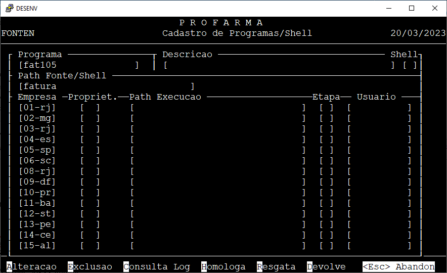

#{ align=left width="70"} { align=left width="70"}
## Ambiente
## CheckList das informações para realizar acesso
1. Endereços dos Servidores Alvo e credenciais com poder de root (sudo); :ok:
2. Endereços do Servidores que será migrado; :ok:
   >Não mais necessário. Arquivos foram copiados para o Linux. Se precisar de mais algum, solicitar ao Adilson
3. Credenciais para acesso via SSH; :ok: 
4. Locais onde são encontrados os fontes do sistema, ambiente de execução, etc. Informações pertinentes para nos encontrarmos no ambiente que será migrado; :ok: 
5. Scripts de Compilação usado hoje e, de deploy. :ok: 


## CheckList de Licenciamento
* Sistema Operacional das licenças estavam como Redhat. :ok:
    * Solicitado ao gerente comercial da Micro Focus a mudança para Suse
    > Resolvido!

## Informações disponibilizadas pela Profarma

Os Fontes estão no diretório /d/fontes e dentro deste há vários sub-diretórios. Exemplo:

* /d/fontes/fatura
* /d/fontes/sap
* /d/fontes/expedicao
* /d/fontes/função
* /d/fontes/stock, dentre outros.
 
Os scripts em shell estão no diretório /d/fontes/shell

As books estão no diretório /d/ncpy

Os executáveis estão nos diretório:
* /d/exec
* /logist/exe
 
Os dados estão em subdiretório dos volumes:
 
* /sap
* /logist
* /image
* /home
* /f
* /d

* Scripts de Compilação usado hoje e, de deploy.

O script é o “c” que fica no diretório /bin do HP-UX
Sintaxe: c nome_do_programa
 
Conteudo:
```
cob -Cautolock -Cfileshare $1.cbl
if test $? -eq 0
then
   echo 'Executa? S/N < > \b\b\b\c'
   read x
   if [ $x = "S" -o $x = "s" ]
   then
      cobrun $1
   fi
fi
```

O deploy é feito através de programa cobol de desenvolvimento interno:

.
